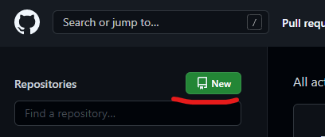
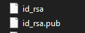
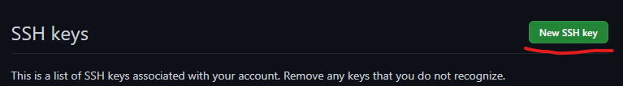

<!---
Inicio do README
-->

# COMO FUNCIONA A INCIALIZAÇÃO DO GIT/GITHUB

## ALGUMAS IDEIAS SOBRE O GIT
* Enquanto outro sistemas trabalham com as diferenças entre os arquivos, o Git trabalha com os estados deles (snapshots)
* Estados dos arquivos dentro do git
  - Untracked (arquivo novo desconhecido)
  - Unmodified (arquivo sem modificações)
  - Modified (arquivo já conhecido mas modificado)
  - Staged (arquivo já conhecido, modificado e salvo para ser comitado)

## 1 - PROJETOS INICIADOS NA MAQUINA
* Se faz necessário a criação do repositório no git do projeto. Os casos de repositórios clonados, o git já é iniciado automaticamente  
```bash
git init (este apenas cria o git localmente)
```
<!----->
* Será necessária a inserção de usuário e email ao git antes de dar commit, push ou pull
```bash
git config user.name "user do github"
git config user.email "email do github"
```
<span style="color:orange">Exemplo</span>

```bash
git config user.name usuario
git config user.email exemplo@gmail.com
```
<!----->
* Para ver o status atual do projeto
```bash
git status
```
<!----->
* Qualquer mudança feita no projeto precisa ser adicionada ao commit, por arquivo ou todos
```bash
git add "nome do arquivo"
```
```bash
git add . (todos)
```
<span style="color:orange">Exemplo</span>

```bash
git add readme.md
```
<!----->
* Para subir as mudanças em commit
```bash
git commit -m "mensagem do commit"
```
<span style="color:orange">Exemplo</span>

```bash
git commit -m "Adição do readme.md"
```
<!----->
* Para verificar todos os commits
```bash
git log
```
<!----->
* Verificar as branchs atuais do sistema
```bash
git branch
```
<!----->
* Para criar uma nova branch
```bash
git branch "nome da branch"
```
<span style="color:red">OBS</span>: 
uma nova branch só pode ser criada após a inserção do primeiro commit
<!----->
* Fazer a troca de branch

```bash
git checkout alteracao (sai da branch atual e vai para a alteração)
```
<!----->
* Verificar todas as configurações do git
```bash
git config --list
```
<!----->
* Concatenação de comandos
```bash
git status && git log
		ou
git status ; git log
```
<!----->
* Uso da configuração "alias" que basicamente cria prefixos para gerar comandos. Por exemplo, o alias "teste" para fazer o comando "git status"
```bash
git config --global alias.teste "git status"
```
Depois, invés de usar "git status" pode usar "git teste"
<!----->
* Para deletar um alias, use:
```bash
git config --global --unset alias.teste
```
<!----->
* Reunindo os dois últimos conceitos, usando um alias para dois comandos
```bash
git config --global alias.teste "!git status & git log"
```
<!----->
Agora vamos ver alguns comandos úteis para desfazer modificações dentro do sistema
* Desfazer uma mudança sem ter enviado para o staged
```bash
git checkout "arquivo"
```
* Desfazer um commit e manter na área de staged
```bash
git reset --soft "hash do commit anterior"
```
* Desfazer um commit e manter na área de modified
```bash
git reset --mixed "hash do commit anterior"
```
* Desfazer um commit e apagar as alterações
```bash
git reset --hard "hash do commit anterior"
```
<span style="color:red">OBS</span>: a hash do commit anterior se tornará a HEAD da branch em questão  
<span style="color:red">OBS2</span>: este comando é interessante quando analisando com commits em ambiente local, sem ainda ter sido enviado para o remoto

## 2 - PROJETOS EM NUVEM (GITHUB)

* Primeiro se faz necessário a criação do repositório no github.  
Pode ser via [desktop](https://desktop.github.com/ ) ou [site](https://github.com/)


<!----->
* Agora precisa associar o seu projeto ao repositório antes de dar pull para o servidor.
```bash
git remote add "URL do repositório" (HTTPS)
git remote add "URL SSH" (SSH: chave precisar estar salva na sua conta github)
```
<span style="color:orange">Exemplo</span>

```bash
git remote git@github.com:usuario/repositorio.git (URL SSH)
```
<span style="color:red">OBS</span>:
você pode ainda dar um clone do repositório criado no github para uma pasta de sua maquina usando git clone

```bash
git clone git@github.com:usuario/repositorio.git (URL SSH)
```
<span style="color:red">OBS</span>:
o uso da opção SSH será explanada mais a frente (item 3)

<!----->
* Para verificar o link basta inserir:
```bash
git remote -v
```
<!----->
* Será necessária a inserção de usuário e email ao git antes de dar commit, push ou pull, independente de ser HTTPS ou SSH
```bash
git config user.name "user do github"
git config user.email "email do github"
```
<span style="color:orange">Exemplo</span>

```bash
git config user.name usuario
git config user.email exemplo@gmail.com
```
Você pode estar informando os campos de forma global para o git de sua maquina, independente do projeto:
```bash
git config --global user.name "user do github"
git config --global user.email "email do github"
```
<span style="color:orange">Exemplo</span>

```bash
git config --global user.name usuario
git config --global user.email exemplo@gmail.com
```
<!----->
* Para verificar estas configurações e outras, pode usar:
```bash
git config --list
```

## 3 - GERAÇÃO E CONFIGURAÇÃO DE CHAVES SSH

* Para funcionar via SSH, deve ser criada a chave da sua máquina para ser inserida no github:
```bash
ssh-keygen -t rsa -b 4096 -C "exemplo@gmail.com"
```
<!----->
* A mesma deve ser gerada dentro da pasta: 
```bash
"C:\\Users\\SEU_USUARIO\\.ssh" (Windows)
"/home/SEU_USUARIO/.ssh" (Linux)
```
<span style="color:red">OBS</span>:
Mais a frente veremos uma forma de personalizar o nome e pasta das chaves, evitando problemas.  

O sistema irá gerar ambas as chaves públicas e privadas. Você pode verificar pelo .pub ao final de uma delas como sendo a pública



Para adicionar ao github, deve-se ir nas configurações > SSH and GPG keys > New SSH key

 


<!----->
* Você pode visualizar os dados da chave pública usando o comando cat ou semelhantes em seu terminal:


Esta será a informação usada no campo "key" do github. O "title" pode ser o modelo do seu computador.
<!----->
* Para testar a validação, basta inserir no terminal:
```bash
ssh -T "git@github.com"
```
Um texto como este deve ser recebido como retorno:
```bash
Hi user.name! You have successfully authenticated, but GitHub does not provide shell access.
```

## 4 - CRIAÇÃO E CONFIGURAÇÃO DO ARQUIVO "CONFIG" DA PASTA .ssh

Com ele é possível direcionar prefixos para um determinado host e user, além de poder gerar chaves em outras pastas e com nomes diferentes, sem que gere problemas na autenticação. No exemplo, faremos o servidor "git@github.com" com a chave pública da conta "exemplo@gmail.com" se tornar o prefixo "github.ex" e ainda colocar as chaves em pasta determinada dentro da .ssh  

Para isso, primeiro devemos criar o arquivo "config", caso ainda não exista, utilizando, por exemplo, a ferramenta do git bash.


* Abra um terminal bash dentro da pasta .ssh e insira o comando:
```bash
touch config
```
<!----->
* Depois, utilize um editor de código como o notepad++ para abrir e editar o arquivo.


Os seguintes campos devem ser inseridos:
```bash
Host github.ex
	HostName github.com
	User git
	IdentityFile ~/.ssh/PASTA_DESEJADA/NOME_DA_CHAVE
	IdentitiesOnly yes
```

<span style="color:orange">Exemplo</span>

```bash
Host github.ex
	HostName github.com
	User git
	IdentityFile ~/.ssh/github/id_github_exemplo
	IdentitiesOnly yes
```

<span style="color:red">OBS</span>:
perceba que a chave tem o nome "id_github_exemplo". Isso porque no ato de geração da chave, temos a opção de mudar contudo sem o arquivo "config", problemas futuros podem surgir.


<!----->
* Depois disso, pode ser testada a validação com o comando já visto, contudo usando o prefixo proposto:
```bash
ssh -T github.ex
```
Um texto como este deve ser recebido como retorno:
```bash
Hi user.name! You have successfully authenticated, but GitHub does not provide shell access.
```
Com isso, é possível clonar seus projetos usando o prefixo determinado
```bash
git clone github.ex:username/repository.git
```

<span style="color:red">OBS</span>:
claramente, só podem ser clonados projetos do repositório Github onde a chave foi inserida

## 5 - SEPARAÇÃO DO ARQUIVO .GITCONFIG
Muitas das vezes, queremos separar os dados de usuário do git a depender do projeto que estamos trabalhando. Como exemplo, podemos usar a ideia de projetos para empresa e pessoal.

Existe uma forma de criarmos mais de um arquivo .gitconfig e chama-lo a depender da pasta que estamos utilizando. Para isso, na mesma pasta do arquivo original, criamos um novo, por exemplo, .gitconfig-empresa.

<span style="color:red">OBS</span>:
o arquivo normalmente se encontra na raiz da pasta do usuário. Ele é criado assim que algum comando de configuração é enviado.

Linux
```bash
nano .gitconfig-empresa ou vim .gitconfig-empresa
```
Windows (bash do Git)
```bash
touch .gitconfig-empresa 
```
O arquivo funciona com um sistema de tags e variáveis. No exemplo abaixo, temos um com a tag user e suas variáveis name e email
```bash
[user]
	name = teste
	email = teste@email.com
```
Quando se utiliza a ideia de configurar uma nova instância do arquivo, uma tag é inserida: includeIf. Com ela, precisam ser passados o caminho para a pasta onde será aplicada as configurações e para o segundo arquivo, este sendo passado na variável path 
```bash
[user]
	name = teste
	email = teste@email.com
[includeIf "gitdir:/path/to/projects/"]
    path = path/to/config-file/.gitconfig-teste
```
Com isso, todas as configurações inseridas no novo arquivo serão automaticamente carregadas assim que utilizar os comandos git na pasta especificada 
## 6 - COMANDOS ÚTEIS

* Troca de usuário global do git de forma simplificada usando alias
```bash
git config --global alias.trocar "!git config --global user.name teste & git config --global user.email exemplo@gmail.com"
```
Depois basta usar o comando abaixo para trocar de usuário:
```bash
git trocar
```

<!---
Fim do README
-->